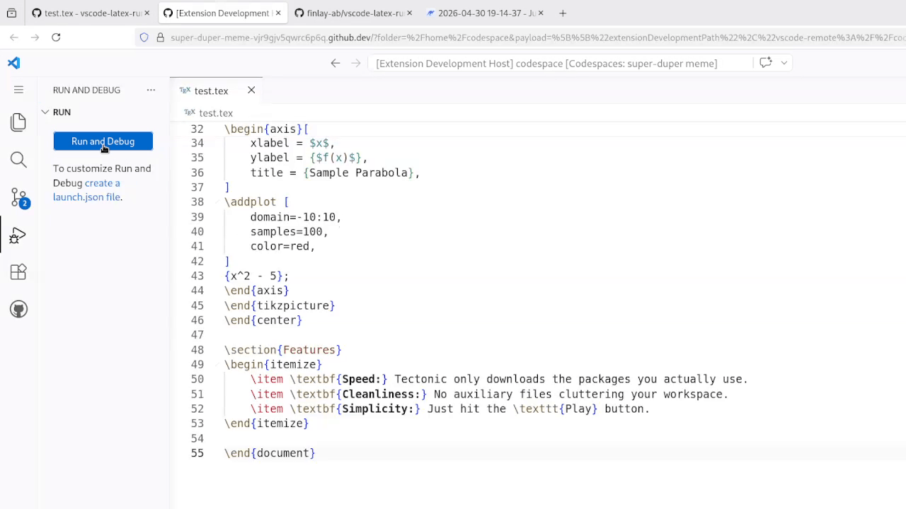

# LaTeX Instant Runner 🚀

**LaTeX Instant Runner** is a zero-config VS Code extension designed specifically for GitHub Codespaces and Linux environments. It turns the complex task of setting up and compiling LaTeX into a simple "one-click" experience.

## ✨ Features

* **One-Click Build:** Adds a clean "Play" button to the top-right of your editor tabs. Just tap it to compile.
* **Auto-Provisioning:** Detects if `pdflatex` is missing and offers to install it for you automatically using a lightweight distribution (`texlive-latex-recommended`).
* **Smart PDF Viewing:** Detects if you have a PDF viewer installed and suggests the best one (Mathematic Inc) if you don't.
* **Automatic Workspace Cleanup:** Silently hides messy `.aux`, `.log`, and `.out` files from your sidebar, but only for the project you are working on—keeping your simulation logs safe.
* **Permission-Proof:** Automatically handles directory switching so you never hit a "Permission Denied" error in system folders.

## 🚀 How to Use

1.  Open any `.tex` or `.latex` file.
2.  Click the **Play Icon** in the top-right corner of the editor title bar.
3.  Follow the prompts to install the LaTeX engine or PDF viewer if it's your first time.
4.  Your PDF will compile and open automatically!

## 📦 Requirements

* **OS:** Linux-based environments (Optimized for **GitHub Codespaces**).
* **Permissions:** Sudo access (included by default in Codespaces) for the automatic LaTeX installation feature.

## 🛠 Extension Settings

This extension is designed to be "Zero-Config," but it does modify the following workspace setting:

* `files.exclude`: Automatically updated to hide LaTeX junk files matching your current document name.

## 📝 Release Notes

### 0.0.1
* Initial Release.
* Added Editor Title Play button.
* Added automatic LaTeX engine detection and installation with UI Progress Bar.
* Added Mathematic Inc PDF viewer suggestion logic.
* Added targeted file-hiding for cleaner workspaces.

---
**Created by Finlay** — Making LaTeX as easy as Markdown.